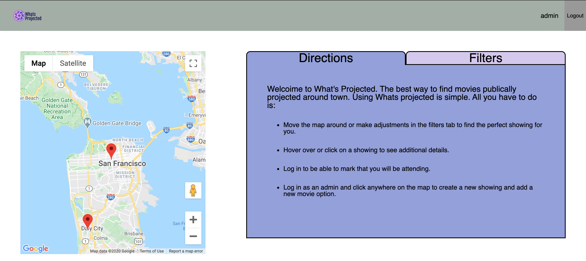

# README

# What's Projected
Whats Projected is an application which intent is to let a user find projector showings based upon the area in which they live. It also allows an admin to create showing events for a user to find.

### Live Link
https://new-projector.herokuapp.com/

### Technologies
- PostgreSQL
- Ruby
- Ruby on Rails
- JavaScript
- React
- Redux
- CSS
- Google Maps API
- Google Geocoding API 

### Features
- Users can adjust the map and other filters to find relavent showings.
- Users can log in and be able to rsvp.
- Admins can log in and create showings and movies.

#### Future Features
- A user show page where users can see all of their upcoming and past shows.
- Allow users to follow other users, and see which shows they are going to.
- More filters, such as genre of movie.
- Potential to play films off of phone, creating a sort of mobile drive in theatre.
